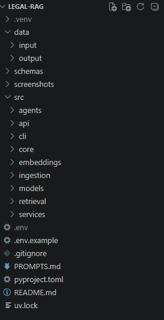
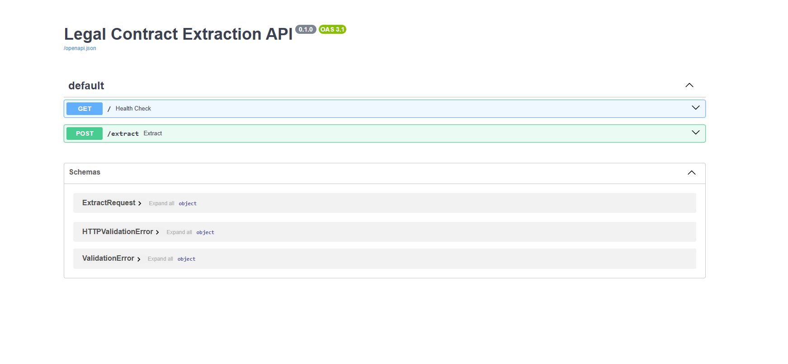
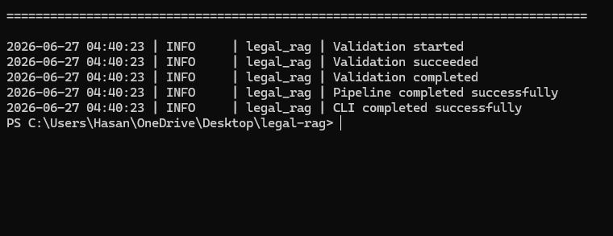
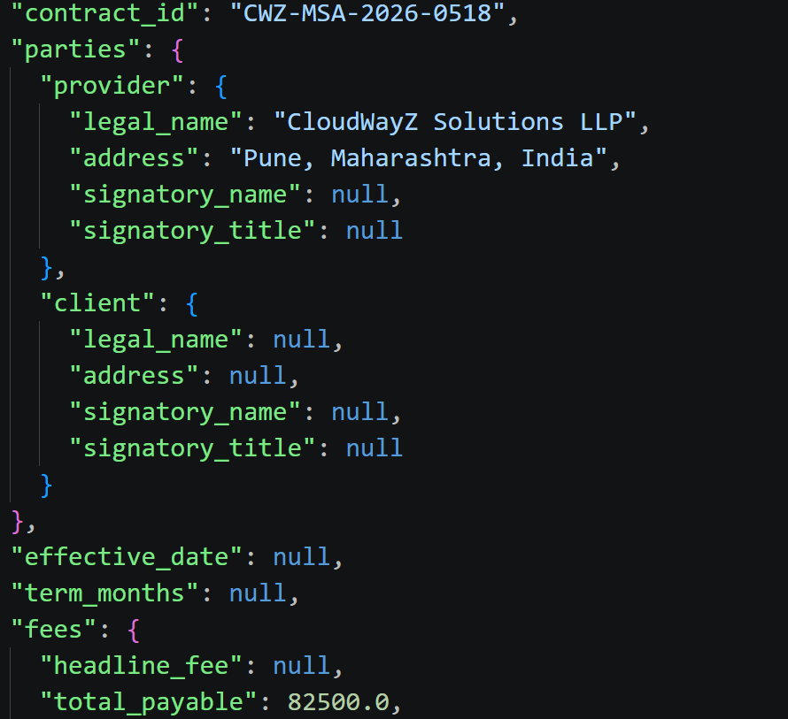

# 📄 Legal Contract Extraction using Agentic RAG

An end-to-end **Agentic Retrieval-Augmented Generation (RAG)** pipeline for extracting structured information from legal contracts using **Gemini 2.5 Flash**, **FAISS**, **Sentence Transformers**, and **FastAPI**.

The system ingests PDF contracts, retrieves the most relevant context using semantic search, and extracts contract information into a validated JSON structure defined by a Pydantic schema.

---

## ✨ Features

- 📄 PDF contract ingestion
- ✂️ Intelligent text chunking
- 🧠 Semantic embeddings using BAAI/bge-small-en-v1.5
- 🔍 FAISS vector similarity search
- 🤖 Gemini 2.5 Flash based extraction
- 📋 Prompt engineering for deterministic JSON output
- ✅ Pydantic schema validation
- 🌐 FastAPI REST API
- 💻 Typer CLI interface
- 📝 Structured logging
- ⚠️ Custom exception handling

---

## 🏗️ Architecture

```text
                PDF Contract
                      │
                      ▼
               PDF Loader
                      │
                      ▼
              Text Chunker
                      │
                      ▼
         Sentence Embeddings
      (BAAI/bge-small-en-v1.5)
                      │
                      ▼
             FAISS Vector Store
                      │
                      ▼
                Retriever
                      │
                      ▼
             Prompt Builder
                      │
                      ▼
           Gemini 2.5 Flash LLM
                      │
                      ▼
           Validation Agent
                      │
                      ▼
        Structured JSON Output
```

---

## 📂 Project Structure

```text
legal-rag/
│
├── data/
│   ├── input/
│   └── output/
│
├── schemas/
│
├── src/
│   ├── agents/
│   ├── api/
│   ├── chunking/
│   ├── cli/
│   ├── core/
│   ├── embeddings/
│   ├── ingestion/
│   ├── models/
│   ├── retrieval/
│   ├── services/
│   └── tests/
│
├── pyproject.toml
└── README.md
```

---

## 🛠 Tech Stack

- Python 3.12
- FastAPI
- Typer
- LangChain
- Google Gemini 2.5 Flash
- FAISS
- Sentence Transformers
- pdfplumber
- Pydantic v2
- Uvicorn

---

## 🚀 Installation

Clone the repository

```bash
git clone https://github.com/hassan2193/legal-rag.git
cd legal-rag
```

Install dependencies

```bash
uv sync
```

---

## ⚙️ Environment Variables

Create a `.env` file.

```env
GOOGLE_API_KEY=your_google_api_key
```

---

## ▶️ Run CLI

```bash
uv run python -m src.cli.main \
  --pdf "data/input/Track1_Sample_Contract.pdf" \
  --schema "schemas/Track1_Extraction_Schema.json" \
  --query "Extract all contract information from this contract." \
  --output "data/output/extraction.json"
```

---

## 🌐 Run FastAPI

```bash
uv run uvicorn src.api.main:app --reload
```

Swagger UI

```
http://127.0.0.1:8000/docs
```

---

## 📄 Sample Output

```json
{
  "contract_id": "CWZ-MSA-2026-0518",
  "effective_date": null,
  "term_months": null,
  "fees": {
    "currency": "USD",
    "total_payable": 82500
  }
}
```

## Folder Structure



## Swagger UI



## CLI



## Sample Output



---

## 🔥 Highlights

- Retrieval-Augmented Generation (RAG)
- Semantic Search using FAISS
- Schema-guided Extraction
- Deterministic Prompt Engineering
- JSON Validation using Pydantic
- Production-style Project Structure
- REST API + CLI Support

---

## 🚀 Future Improvements

- Hybrid Search (BM25 + FAISS)
- Cross-Encoder Re-ranking
- OCR Support for scanned PDFs
- Docker Support
- CI/CD with GitHub Actions
- Streamlit Web Interface
- Evaluation Pipeline
- Multi-document Retrieval

---

## 👨‍💻 Author

**Hasan Raza**

GitHub: https://github.com/hassan2193
